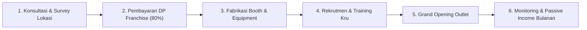

# 🤝 Program Kemitraan & Franchise - Dimsum Hallo Dek (DHD)

> **Entitas**: PT Merza Perintis Sukses  
> **Konsep Bisnis**: 100% Autopilot Franchise Kuliner Modern  
> **Value Proposition**: Bangun usaha kuliner menguntungkan tanpa repot branding, marketing, dan operasional harian.

---

## 1. Mengapa Bermitra dengan Dimsum Hallo Dek?

1. **Brand Terpercaya**: Basis pelanggan loyal di puluhan titik Jabodetabek & Sukabumi.
2. **Sistem Autopilot Terpusat**: Manajemen profesional mengurus seluruh rantai pasok dan operasional.
3. **Dukungan Marketing Terus Menerus**: Promosi aktif media sosial, kolaborasi influencer, aktivasi lokal.
4. **Laporan Keuangan Transparan**: Data omzet, opex, dan profit dikirim berkala langsung dari sistem POS.
5. **Kualitas Bahan Baku Terjaga**: Menggunakan daging ayam pilihan dengan SOP standar pabrikasi.
6. **Passive Income Rutin**: Mitra tinggal memantau hasil bagi hasil setiap bulan tanpa pusing kelola staf.

---

## 2. Skema Finansial & Bagi Hasil

| Komponen | Rincian / Kebijakan |
|---|---|
| **Masa Kontrak Franchise** | 3 Tahun |
| **Biaya Perpanjangan Kontrak** | Rp 15.000.000 (setelah 3 tahun) |
| **Skema Bagi Hasil (Profit Share)** | **70% Manajemen : 30% Mitra** |
| **Royalty Fee** | **Rp 0,-** (Sudah termasuk dalam pembagian bagi hasil) |
| **Metode Pembayaran** | DP 80% saat booking (max 7 hari), pelunasan sisa 20% pada H-7 Grand Opening |
| **Waktu Persiapan Gerai** | Maksimal 3 bulan sebelum hari pembukaan (Grand Opening) |

---

## 3. Paket Investasi Kemitraan

### Paket Premium Booth Container Gerobak
- **Ukuran Booth**: 150 cm x 60 cm x 200 cm (Bahan kokoh, tahan cuaca outdoor/semi-outdoor).

| Pilihan Lokasi | Biaya Investasi | Keterangan |
|---|---|---|
| **Area Ring 1 (Radius ≤ 15 km)** | **Rp 28.000.000** | Dekat dengan central kitchen (Cileungsi / Cibubur) |
| **Area Ring 2 (Radius > 25 km)** | **Rp 35.000.000** | Termasuk logistik pengiriman & penyesuaian operasional |

#### Fasilitas & Perlengkapan Lengkap (Turnkey Ready):
- 1 Unit Booth Container eksklusif Dimsum Hallo Dek
- Kompor gas panggang 2 in 1
- Panci kukusan stainless steel besar
- Botol saus food grade, capitan, dan peralatan masak
- Menu lightbox illuminated & banner display
- Perlengkapan dapur, regulator & tabung gas LPG, torch burner khusus
- **Bahan Baku Awal**: 500 pcs Dimsum ayam beku + seluruh varian saus lengkap
- Kemasan takeaway food grade, paper bag, stiker, tusukan, dan seragam outlet
- **Sistem POS**: Tablet kasir + aplikasi POS terintegrasi real-time ke pusat

---

## 4. Simulasi Proyeksi Keuntungan (Konservatif)

*Contoh simulasi bulanan per gerai:*

```
Omzet Rata-rata Bulanan   : Rp 25.000.000
Biaya Operasional (Opex)  : Rp 10.000.000  (Bahan baku, gaji staf, utilitas/sewa)
------------------------------------------------
Laba Bersih Outlet        : Rp 15.000.000

Pembagian Keuntungan Bersih:
- Bagian Mitra (30%)      : Rp  4.500.000 / bulan (Passive Income)
- Bagian Manajemen (70%)  : Rp 10.500.000 / bulan (Pengelolaan all-in)

Estimasi Balik Modal (Payback Period / BEP): ~6 - 8 Bulan!
```

---

## 5. Alur Bergabung (6 Langkah Mudah)



---

## 6. Syarat & Kebijakan Pembatalan / Refund

- **Ketentuan DP**: DP 80% wajib diselesaikan max 7 hari kerja setelah pengajuan lokasi disetujui.
- **Pembatalan oleh Mitra**: Jika mitra mengundurkan diri setelah DP, berlaku potongan 45% dari total DP untuk menutup biaya custom produksi booth dan peralatan yang sudah berjalan. Sisa 55% dikembalikan.
- **Garansi 100% Refund**: Jika dalam waktu 3 bulan setelah DP belum terlaksana Grand Opening yang disebabkan kelalaian pihak manajemen, uang DP dikembalikan 100% tanpa potongan.
