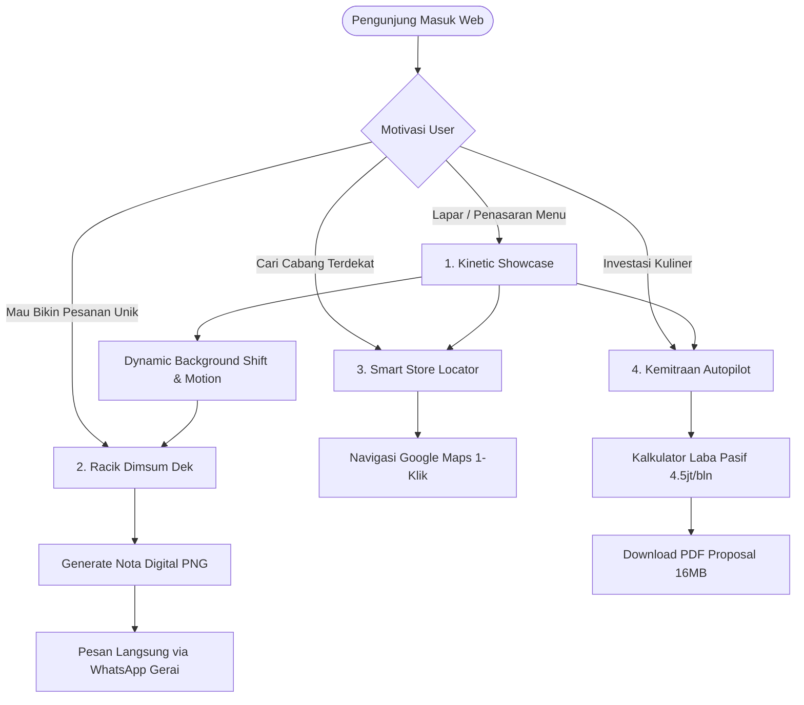
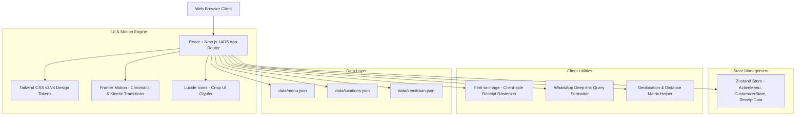

# 🥟 PRODUCT REQUIREMENT DOCUMENT (PRD)
## Project: Dimsum Hallo Dek (DHD) - Interactive Kinetic Showcase & Brand Experience
**Entity:** PT Merza Perintis Sukses  
**Reference Interaction Architecture:** [Warmindo Showcase by Wildan Niam](https://wildan-niam.myr.id/catalog/warmindo-showcase-source-code-website-react/)  
**Document Version:** 1.0.0 (Master Release)  
**Status:** Approved for Engineering & Design  

---

## 1. Executive Summary & Vision

### 1.1 Problem Statement
Website resmi eksisting ([`merzaperintissukses.com`](https://merzaperintissukses.com/)) saat ini menggunakan template WordPress generic (Hestia Theme) yang pasif, membosankan, memiliki visual hierarchy buruk, dan gagal merepresentasikan positioning brand kuliner modern dengan 27+ gerai aktif. Pengunjung tidak merasakan "kelezatan visual" dari signature saus torched (Mentai, Carbonara, Hot Lava), dan tidak ada interaksi yang memicu konversi pembelian maupun *viral sharing*.

### 1.2 Product Vision
Mentransformasi website Dimsum Hallo Dek menjadi **Web App Showcase Kuliner Interaktif Kelas Dunia**, mengadopsi prinsip desain dari referensi *Warmindo Showcase*:
1. **Dynamic Chromatic Mood**: Background berganti warna gradien secara halus (*smooth color transition*) mengikuti identitas dan profil rasa menu yang sedang aktif.
2. **Kinetic Food Motion**: Piring/bowl dimsum menjadi *center of gravity* dengan animasi transisi 3D/slide halus, dipadukan elemen bahan melayang (*floating parallax ingredients*: potongan nori, cabai, minyak cabai, biji wijen, asap kukusan) yang bergerak dinamis.
3. **Interactive Dimsum Customizer ("Racik Dimsum Dek")**: Pengunjung dapat memilih varian dimsum, mengombinasikan aneka saus lumer, dan menambahkan topping favorit dengan live visual feedback.
4. **Viral Digital Receipt Generator ("Nota Dimsum Dek")**: Mengonversi racikan pengguna menjadi struk/nota digital berestetika retro-modern yang dapat diberi nama unik, disimpan sebagai gambar PNG, atau dibagikan langsung ke WhatsApp untuk pemesanan instan.
5. **Seamless Dual Conversion Engine**: Menghubungkan pengalaman interaktif ini secara langsung ke **Smart Store Locator** (27+ cabang) dan **Portal Kemitraan Franchise Autopilot** (Rp 28jt - 35jt).

---

## 2. Product Goals & Target KPIs

| Metric | Target | Rationale |
|---|---|---|
| **Average Session Duration** | > 2 Menit 45 Detik | Pengunjung betah mengeksplorasi showcase, geser menu, dan meracik topping. |
| **Interactive Customizer Completion** | > 35% Total Visitors | Pengunjung menyelesaikan racikan dan membuka layar struk/nota. |
| **Viral Receipt Shares / Downloads** | > 15% Customizer Users | User menyimpan PNG atau share tautan racikan ke media sosial / WA Story. |
| **Store Locator Click-Through Rate** | > 20% Total Visitors | Mengarahkan pembeli langsung ke outlet fisik terdekat via Google Maps. |
| **Franchise Inquiries (B2B Leads)** | > 5 Qualified Leads / Minggu | Calon mitra langsung menghubungi WhatsApp Minsum Kemitraan setelah membaca simulasi profit autopilot. |
| **Page Speed & Core Web Vitals** | 95+ Mobile / Desktop (LCP < 1.2s, 60 FPS animation) | Menjamin transisi motion mulus tanpa stuttering di device low-end sekalipun. |

---

## 3. User Personas & Core Journeys



---

## 4. UI/UX Design System & Chromatic Interaction Engine

### 4.1 The Chromatic Theme Palette (Dynamic State per Menu)

Setiap item menu mengontrol token CSS background (`--theme-bg-start`, `--theme-bg-end`, `--theme-accent`, `--theme-text-glow`). Ketika menu bergeser, background akan melakukan interpolasi warna linear menggunakan `transition: background 600ms cubic-bezier(0.16, 1, 0.3, 1)`.

| Menu Item | Dominant Flavor Profile | Background Gradient (Start -> End) | Accent Color | Mood Description |
|---|---|---|---|---|
| **01. Dimsum Mix Mentai Tartar** | Creamy, Gurih, Fresh Tartar, Torched | `#C2410C` (Warm Burnt Ochre) → `#451A03` (Deep Toasted Amber) | `#F59E0B` (Amber Gold) | Hangat, smoky, appetite-inducing, gurih creamy |
| **02. Dimsum Carbonara** | Cheesy, Rich Cream, Nori Flakes | `#854D0E` (Golden Mustard) → `#361E04` (Warm Brown Truffle) | `#FDE047` (Parmesan Gold) | Mewah, creamy, buttery, western fusion vibe |
| **03. Dimsum Hot Lava Mentai** | Extra Spicy, Creamy Fire, Bold | `#991B1B` (Volcano Crimson) → `#3F0707` (Deep Obsidian Red) | `#EF4444` (Fiery Chili) | Pedas menggigit, intens, energik, menggugah selera |
| **04. Dimsum Cake Birthday Tower** | Party, Celebration, Multi-topping | `#4C1D95` (Celebration Indigo) → `#1E1B4B` (Midnight Velvet) | `#F472B6` (Festive Magenta) | Meriah, premium, festive celebration |
| **05. Dimsum Platter 16 pcs Rame-Rame** | Sharing Feast, Community Box | `#1F2937` (Dark Slate) → `#0F172A` (Deep Umami Charcoal) | `#38BDF8` (Fresh Blue Ribbon) | Modern, party sharing, sleek, exclusive |

### 4.2 Typography Hierarchy
- **Watermark Parallax Text (Background Layer):**
  - Font: `Outfit` / `Clash Display` / `Impact-style Sans`
  - Style: Ultra-large (clamp(80px, 15vw, 240px)), All-Caps, Opacity `0.06` hingga `0.10`, Pointer-events none.
  - Value dinamis: `"MENTAI."`, `"CARBONARA."`, `"HOT LAVA."`, `"RACIK."`, `"PUNYAMU."`.
  - Animasi: Parallax sliding horizontal saat geser menu (translate-x +/- 80px).
- **Hero Title (Foreground):**
  - Font: `Plus Jakarta Sans` / `Outfit` (Weight 900 / Black).
  - Style: Font-size clamp(42px, 6vw, 76px), Line-height 0.95, Color: `#FFFDF7` (Warm Off-White).
- **Body & Metadata:**
  - Font: `Plus Jakarta Sans` (Regular 400, Medium 500, Semi-bold 600).

### 4.3 Motion Choreography & Kinetic Physics (Framer Motion Specs)
1. **Hero Dish Transition:**
   - Exit animation: `opacity: 0, scale: 0.85, x: -120px, rotate: -8deg` (durasi 450ms, ease: `[0.32, 0, 0.67, 0]`).
   - Enter animation: `opacity: 1, scale: 1, x: 0, rotate: 0deg` (durasi 600ms, ease: `[0.16, 1, 0.3, 1]`).
2. **Ambient Floating Ingredients (Parallax Layer):**
   - 4-6 elemen mikro per menu (daun bawang iris, irisan cabai merah, potongan nori, wijen, api torch particle).
   - Animasi continuous idle: `y: [-8, 8, -8], rotate: [-4, 4, -4]` dengan durasi acak 3.5s - 5s ease-in-out infinite.
   - Mouse parallax: Elemen bergerak berlawanan arah dengan cursor mouse (+/- 15px depth factor).
3. **Reduced Motion Mode:**
   - Deteksi `@media (prefers-reduced-motion: reduce)`. Jika aktif, disable float loop dan ganti transisi menjadi `opacity cross-fade (200ms)`.

---

## 5. Functional Requirements & Feature Breakdown

### 5.1 Module A: Kinetic Menu Showcase (The Core Experience)
- **A.1 Slide Navigation Controller**:
  - Tombol Navigasi Kiri (`←`) dan Kanan (`→`) dengan efek hover spring.
  - Keyboard Arrow Navigation (`ArrowLeft`, `ArrowRight`) & Touch Swipe support di mobile.
  - Counter Index dinamis (contoh: `01 / 05`).
  - Pagination Pills di pojok kanan bawah dengan label nama menu (klik langsung loncat ke menu terkait).
- **A.2 Content Display per Menu**:
  - Badge Kategori (contoh: `⭐ RECOMMENDED`, `🧀 CHEESY + CREAMY`, `🔥 SPICY + CREAMY`).
  - Nama Menu (contoh: `DIMSUM MIX MENTAI TARTAR.`).
  - Emotive One-liner Tagline (contoh: *"Gurih creamy saus mentai ditorch berpadu tartar segar.*").
  - Harga Referensi Gerai (contoh: `Rp 18.000` *harga estimasi per porsi*).
  - CTA Button:
    - Primary: `Racik Versimu →` (Membuka Module B: Customizer).
    - Secondary: `Beli di Gerai Terdekat 📍` (Scroll ke Module D: Store Locator).

### 5.2 Module B: Interactive Dimsum Customizer ("Racik Dimsum Dek")
Terinspirasi dari fitur *"Racik Punyamu"* Warmindo, namun dimodifikasi khusus untuk ekosistem Dimsum Hallo Dek:
- **B.1 Tahap 1: Pilih Porsi Dasar Dimsum (Base)**
  - Pilihan:
    - *Isi 4 pcs (Porsi Personal)* - Base Rp 15.000
    - *Isi 6 pcs (Porsi Puas)* - Base Rp 22.000
    - *Isi 16 pcs (Party Platter)* - Base Rp 55.000
    - *Dimsum Cake Tower (Birthday Special)* - Base Rp 120.000
- **B.2 Tahap 2: Pilih Signature Saus Lumer (Bisa Mix)**
  - Saus Mentai Torched (+ Rp 3.000)
  - Saus Carbonara Smoky (+ Rp 3.000)
  - Saus Hot Lava Pedas (+ Rp 3.000)
  - Original Chili Oil & Bangkok Sauce (Free / Sudah termasuk)
- **B.3 Tahap 3: Ekstra Topping Taburan**
  - Roasted Nori Flakes (+ Rp 2.000)
  - Melted Mozzarella Torched (+ Rp 4.000)
  - Crunchy Fried Garlic (+ Rp 2.000)
  - Ekstra Tobiko Mentai (+ Rp 3.000)
- **B.4 Live State Updates**:
  - Visual piring dimsum di sebelah kanan secara real-time menambah layer topping grafis sesuai pilihan.
  - Display harga total otomatis terakumulasi secara real-time.
  - Tombol: `Kembalikan Awal` (Reset) & `Lihat Nota Racikanku →`.

### 5.3 Module C: Digital Receipt Generator & Viral Share ("Nota Dimsum Dek")
- **C.1 Form Input & Branding**:
  - Input field: *"Kasih Nama Racikanmu"* (Placeholder: *"Dimsum Bahagia Begadang"*, *"Paket Ngobrol Santai"*, *"Spicy Mentai Overkill"*).
  - Quick Suggestion Badges: User bisa klik nama template instan.
- **C.2 Render Struk Digital (Retro Thermal Receipt Card)**:
  - Header: Logo resmi Dimsum Hallo Dek + Slogan *"#AutoHappy Setiap Hari"*.
  - Detail racikan: Varian base, saus terpilih, ekstra topping, dan breakdown harga.
  - Subtotal, Service/Tax placeholder (Rp 0), Total Final.
  - Barcode dekoratif fungsional (encoded dengan nomor WA order).
  - Footer kata-kata manis khas Minsum: *"Makan enak gak harus ribet. Beda selera, tetap semeja."*
- **C.3 Action Buttons**:
  - `Simpan Gambar (PNG)`: Memanfaatkan library `html-to-image` / Canvas untuk mendownload struk resolusi tinggi yang siap diposting ke IG Story/WhatsApp Status.
  - `Pesan Langsung via WhatsApp`: Otomatis men-generate deep-link WhatsApp ke CS Minsum dengan pesan terformat:
    ```
    "Halo Minsum! Gua mau pesan racikan: [Nama Racikan]
    - Base: Dimsum Isi 6 pcs
    - Saus: Mentai Torched + Hot Lava
    - Topping: Mozzarella + Nori
    Total: Rp 31.000
    Bisa dikirim dari gerai terdekat gak?"
    ```
  - `Salin Tautan Racikan`: Meng-encode state racikan ke URL query params (`?base=6&sauce=mentai,lava&top=mozza,nori`) agar teman bisa membuka racikan yang sama.

### 5.4 Module D: Smart Store Locator (27+ Cabang)
- **D.1 Search & Filter Engine**:
  - Search bar interaktif dengan autocomplete pencarian nama jalan, kecamatan, atau kelurahan.
  - Region Quick Tabs: `Semua (27+)` | `Cileungsi & Kab. Bogor (14)` | `Kota Bogor (4)` | `Bekasi (2)` | `Sukabumi (7)`.
- **D.2 Outlet Card Information**:
  - Nama Gerai (contoh: **Permata Cibubur HQ**, **Cabang ke-29 Dayeuh Luhur**).
  - Alamat detail & Patokan Landmark (contoh: *Di Alfamidi / Di Dan+Dan / Seberang Yomart*).
  - Button direct: `Buka di Google Maps ↗` (langsung membuka navigasi GPS di smartphone user).

### 5.5 Module E: Franchise Autopilot Portal (B2B Revenue Driver)
- **E.1 Hero Proposition**:
  - *"Bangun Usaha Kuliner Menguntungkan Tanpa Pusing Branding & Operasional Harian."*
  - Badge: `100% Autopilot System` | `Bagi Hasil 70:30` | `27+ Cabang Aktif`.
- **E.2 Interactive ROI Calculator**:
  - Slider omzet estimasi: Rp 15jt - Rp 40jt/bulan (Default: Rp 25jt).
  - Output dinamis: Estimasi Laba Bersih & Estimasi Passive Income Mitra (**Rp 4.500.000 / bln** pada omzet 25jt).
- **E.3 Package Comparison & Facility Grid**:
  - Paket Radius ≤ 15 km: **Rp 28.000.000**
  - Paket Radius > 25 km: **Rp 35.000.000**
  - Grid spesifikasi Booth Container (150x60x200 cm), kompor 2 in 1, steamer, POS kasir, dan first stock 500 pcs dimsum.
- **E.4 Direct CTAs**:
  - `Download Proposal Kemitraan (PDF)`: Mengunduh file resmi [`assets/Bergabunglah_bersama_kemitraan_DHD.pdf`](file:///home/haikaru/Archverse/Lab/Client/Dimsumhallodek/assets/Bergabunglah_bersama_kemitraan_DHD.pdf).
  - `Konsultasi Franchise via WhatsApp`: Direct link ke WhatsApp tim kemitraan (`+62 858-0285-4744`).

---

## 6. Technical Architecture & Tech Stack



### 6.1 Recommended Stack
- **Framework:** Next.js 14/15 (React 18/19, App Router) atau Vite + React (TypeScript).
- **Styling Engine:** Tailwind CSS dengan dynamic CSS variables support.
- **Animation Engine:** `framer-motion` (untuk dynamic layout transitions, drag gestures, animate presence, dan SVG path animation).
- **Image Generation:** `html-to-image` atau `html2canvas` (client-side generation nota PNG tanpa backend overload).
- **Icons:** `lucide-react`.
- **Hosting / Deployment:** Vercel atau Cloudflare Pages (Free tier, Global Edge CDN, SSL automatic, 100 PageSpeed capable).

---

## 7. Non-Functional Requirements

### 7.1 Performance & Core Web Vitals
- **LCP (Largest Contentful Paint):** < 1.2 detik (Gambar makanan WebP terkompresi dengan `priority` loading).
- **FID / INP (Interaction to Next Paint):** < 50ms saat pergantian tema warna dan geser carousel.
- **CLS (Cumulative Layout Shift):** 0.00 (Semua container piring dan elemen teks memiliki rasio dimensi terdefinisi).
- **Asset Optimization:** Semua foto piringan dimsum menggunakan format WebP transparan resolusi tinggi (maks 250 KB per asset).

### 7.2 Accessibility & Usability (a11y)
- Kontras warna teks terhadap background dinamis selalu memenuhi standar minimum WCAG 2.1 AA (rasio kontras > 4.5:1).
- Dukungan navigasi penuh menggunakan keyboard (Tab, Enter, Escape, Arrow Keys).
- Dukungan `prefers-reduced-motion` untuk user yang sensitif terhadap motion blur atau animasi cepat.

---

## 8. Implementation Roadmap & Milestones

| Phase | Milestone Scope | Output Deliverables |
|---|---|---|
| **Phase 1: Foundation & Kinetic Showcase** | Setup Next.js + Tailwind, setup dynamic chromatic background engine, implement carousel piringan dimsum dengan parallax floating ingredients & watermark typography. | Modul Showcase berfungsi penuh dengan 5 menu dan perpindahan warna mulus. |
| **Phase 2: Customizer & Struk Generator** | Implementasi flow *"Racik Dimsum Dek"*, real-time visual modifier, penghitungan harga live, dan generator struk PNG digital dengan share ke WhatsApp. | User bisa meracik dimsum dan mengunduh nota PNG atau pesan ke WA. |
| **Phase 3: Smart Store Locator & Franchise Funnel** | Implementasi database 27+ outlet dengan search & filter regional, ROI calculator interaktif, dan download proposal PDF kemitraan. | Halaman gerai interaktif dan landing section kemitraan siap konversi. |
| **Phase 4: Optimization, Mobile QA & Launch** | Audit Core Web Vitals, testing responsivitas di berbagai layar smartphone, integrasi custom domain `merzaperintissukses.com`. | Production deploy live dengan PageSpeed score 95+. |
