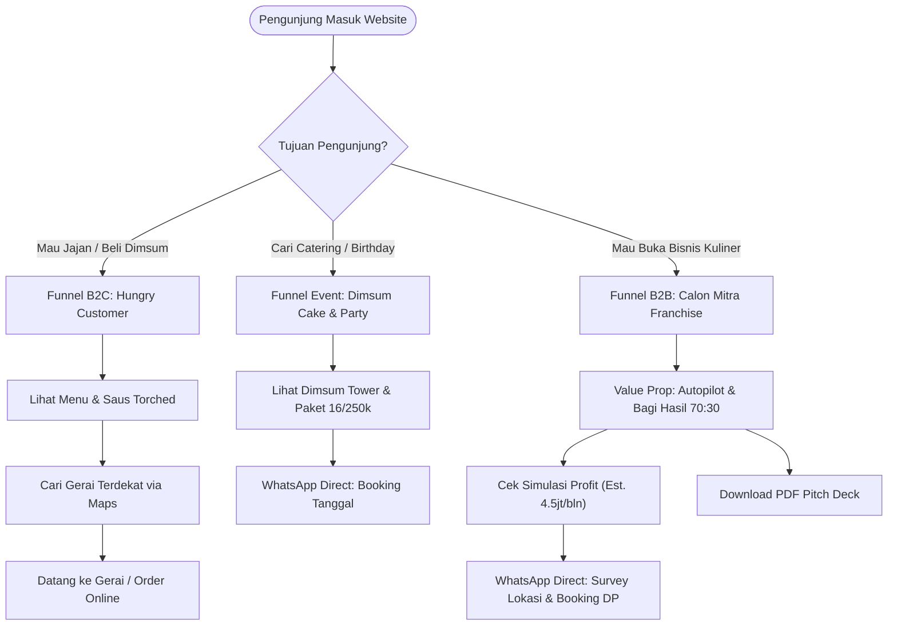

# 🚀 Rebuild Specification & UI/UX Master Blueprint
## Target: Rebuilding `merzaperintissukses.com` (Dimsum Hallo Dek)

---

## 1. 🩸 Brutal Audit: Masalah Fatal Website Saat Ini

Website saat ini menggunakan template WordPress generic (**Theme Hestia** + WPForms + Mailin) yang sangat tidak mencerminkan brand F&B modern dengan 29+ cabang. Berikut kelemahan kritikalnya:

| Aspek | Kondisi Saat Ini (Legacy WP) | Dampak Negatif | Solusi Redesign |
|---|---|---|---|
| **Branding & Visual Palette** | Memakai warna default tema Hestia (magenta `#e91e63` dan ungu gradient). | Tidak membangkitkan selera makan (*unappetizing*), terkesan template murah belum selesai di-custom. | Gunakan palet hangat kuliner: **Warm Amber Gold (`#F59E0B`), Spicy Red (`#EF4444`), Deep Charcoal (`#18181B`), dan Creamy Off-White (`#FFFDF7`)**. |
| **Dual-Audience Confusion** | Pengunjung umum (yang mau jajan dimsum) dan calon investor (kemitraan franchise) dicampur aduk tanpa funnel yang jelas. | Bounce rate tinggi. Calon pembeli bingung cara order, calon mitra malas nyari info. | **Clear Dual-Conversion Hero & Navigation**: Split funnel antara `Jelajah Menu & Gerai` (B2C) vs `Peluang Franchise Autopilot` (B2B). |
| **Menu Showcase Miskin Interaksi** | Menu cuma ditampilkan 3 biji di dalam section *testimonial* bawaan Hestia. | Pelanggan tidak tahu varian lengkap, harga, atau keunikan saus torched-nya. | **Interactive Food Catalog**: Filter kategori (Mentai, Cheesy/Carbonara, Hot Lava, Party/Cake), badge promo, aroma description, tombol order. |
| **Store Locator Primitif** | Halaman `/sample-page/` cuma berisi tabel HTML mentah tanpa peta, tanpa pencarian, tanpa filter kota. | User di HP malas scroll tabel panjang untuk cari cabang terdekat. | **Smart Store Locator**: Search box, filter pill per kota (Bogor, Bekasi, Sukabumi), tombol langsung buka Google Maps navigation, deteksi lokasi terdekat via Geolocation. |
| **Franchise Deck Tersembunyi** | Info kemitraan cuma diselipin berupa link Google Drive di section tim. Padahal ini revenue driver utama PT Merza Perintis Sukses! | Kehilangan prospek kemitraan bernilai puluhan juta rupiah. | **High-Converting Franchise Section & Landing Page**: Showcase booth container, simulasi hitung profit interaktif (ROI calculator), rincian paket 28jt vs 35jt, dan instant WA consultation. |
| **Performance & Mobile Responsiveness** | Bloated WP scripts, unoptimized CSS dari berbagai plugin lama. | Loading lambat di jaringan HP 4G/3G pinggiran kota. | **Next.js / Tailwind / Static Export**: Instant 100 PageSpeed score, gambar WebP optimized, ultra responsive. |

---

## 2. 🎯 User Personas & Conversion Journeys



---

## 3. 🎨 Design System & Visual Tokens

### 3.1 Color Palette
```css
:root {
  /* Primary Brand (Dimsum Warmth) */
  --primary-500: #F59E0B;       /* Amber Gold - warmth, appetite, energic */
  --primary-600: #D97706;       /* Deep Gold */
  --primary-hover: #B45309;

  /* Secondary / Accent (Spicy Torched Accent) */
  --accent-red: #EF4444;        /* Sriracha / Mentai Chili */
  --accent-torch: #DC2626;

  /* Neutrals & Dark Theme Support */
  --bg-main: #FAFAF9;           /* Stone 50 - clean warm background */
  --bg-surface: #FFFFFF;        /* Card surface */
  --bg-dark: #18181B;           /* Zinc 900 - sleek dark contrast */
  --text-main: #1C1917;         /* Stone 900 - high readability */
  --text-muted: #78716C;        /* Stone 500 */
  --border-subtle: #E7E5E4;     /* Stone 200 */

  /* Highlight Badges */
  --badge-recommended: #FEF3C7; /* Amber 100 */
  --badge-recommended-text: #92400E;
  --badge-spicy: #FEE2E2;       /* Red 100 */
  --badge-spicy-text: #991B1B;
}
```

### 3.2 Typography Hierarchy
- **Display / Heading**: `Plus Jakarta Sans` atau `Outfit` (Bold / Extrabold, modern tech-lifestyle vibe).
- **Body / Subtitles**: `Inter` atau `Plus Jakarta Sans` (Regular, Medium, 15px - 17px line-height 1.6).

---

## 4. 📐 Wireframe & Section Architecture (One-Page / Multi-Section)

### Section 1: Header / Sticky Glassmorphism Navbar
- **Left**: Logo Dimsum Hallo Dek + PT Merza Perintis Sukses badge.
- **Center**: Nav Links (`Menu`, `Party & Event`, `Lokasi 29+ Gerai`, `Kemitraan Franchise`, `Tentang Kami`).
- **Right Action Buttons**:
  - `Cari Gerai Terdekat` (Outline button dengan icon MapPin)
  - `Hubungi Minsum (WA)` (Solid Gold button dengan icon WhatsApp)

### Section 2: High-Impact Hero Section
- **Headline**: *Rasakan Sensasi Dimsum Full Daging dengan Saus Mentai Torched yang Nagih!*
- **Sub-headline**: *#AutoHappy Setiap Hari. Hadir di 29+ cabang se-Bogor, Bekasi, dan Sukabumi.*
- **Dual CTA**:
  1. Primary CTA: `Lihat Menu Unggulan` (Anchor scroll to `#menu`)
  2. Secondary CTA: `Peluang Kemitraan Autopilot` (Anchor scroll to `#franchise`)
- **Hero Image / Slider**:
  - Visual Dimsum Cake Tower (`ChatGPT-Image-Jun-5-2026-01_22_12-PM-Copy.png`)
  - Floating badge 1: `🔥 100% Full Daging Ayam Asli`
  - Floating badge 2: `⭐ 29+ Cabang Aktif`

### Section 3: Trust Bar & Value Pillars
- 4 Grid Cards:
  1. **Full Daging Ayam**: Tanpa tepung berlebih, tekstur padat & juicy.
  2. **Signature Sauces**: Mentai Torched, Carbonara Smoky, Hot Lava Pedas Gurih.
  3. **Event Ready**: Spesialis Dimsum Cake Ulang Tahun & Paket Sharing Rame-Rame.
  4. **Kemitraan Autopilot**: Dikelola 100% oleh tim pusat, pasif profit bulanan.

### Section 4: Signature Food Showcase (Interactive Menu)
- **Category Filter Tabs**: `Semua`, `Mentai Series`, `Cheesy Carbonara`, `Spicy Hot Lava`, `Party & Tower`.
- **Card Design**:
  - Foto dimsum high-res dengan efek zoom halus saat hover.
  - Category Badge (`Recommended`, `Cheesy + Creamy`, `Spicy + Creamy`).
  - Nama produk & komposisi rasa (Flavor Notes tag: `Creamy`, `Smoky`, `Spicy`).
  - Tombol aksi: `Pesan via WhatsApp` / `Cari di Gerai Terdekat`.

### Section 5: Party, Wedding & Corporate Catering
- **Showcase Produk**: Dimsum Cake / Birthday Tower & Platter Box Isi 16.
- **Selling Points**:
  - Pilihan unik pengganti kue tart konvensional.
  - Bisa request lilin, kartu ucapan, dan custom topper.
  - Layanan live torched di venue event (Wedding, Gathering, Pameran).
- **CTA**: `Konsultasi Paket Acara (Minsum Event Specialist)`

### Section 6: Smart Store Locator (29+ Cabang)
- **UI Elements**:
  - Search Input: *"Cari berdasarkan kecamatan atau nama jalan (contoh: Cibubur, Sukaraja, Kranggan)..."*
  - Region Selector Buttons: `Semua (27+)` | `Cileungsi & Kab. Bogor (14)` | `Kota Bogor (4)` | `Bekasi (2)` | `Sukabumi (7)`.
  - Grid gerai:
    - Nama cabang (e.g. **Permata Cibubur HQ**, **Cabang ke-29 Dayeuh Luhur**).
    - Alamat lengkap & landmark (e.g. Di Alfamidi / Di Dan+Dan / Dekat Yomart).
    - Action CTA: Direct link Google Maps (buka aplikasi Maps langsung di smartphone).

### Section 7: B2B Franchise / Kemitraan Autopilot (The Money Maker)
- **Headline**: *Punya Usaha Kuliner Menguntungkan Tanpa Pusing Urus Operasional Harian.*
- **Key Proposition Grid**:
  - 100% Autopilot (Rekrutmen, SOP, QC, bahan baku diurus pusat).
  - Skema Bagi Hasil Adil: **70% Manajemen : 30% Mitra**.
  - Kontrak 3 Tahun, Tanpa Royalty Fee Bulanan Tersembunyi.
- **Paket Investasi**:
  - **Paket Radius ≤ 15 KM**: Rp 28.000.000 (Central Area)
  - **Paket Radius > 25 KM**: Rp 35.000.000 (Outer Area)
  - Fasilitas booth container lengkap (kompor 2-in-1, steamer, torch, tablet kasir, free 500 pcs dimsum).
- **Interactive Profit Calculator**:
  - Slider omzet bulanan (Default Rp 25 jt)
  - Kalkulasi laba bersih (Est. Rp 15 jt)
  - Estimasi passive income mitra: **Rp 4.500.000 / bulan**.
- **Download Action**:
  - Tombol `Download Proposal Kemitraan (PDF)`
  - Tombol `Jadwalkan Konsultasi & Survey Lokasi (WhatsApp)`

### Section 8: Testimoni & Social Proof
- Customer reviews, antrian booth (`705607540_...jpg`), dokumentasi pembukaan gerai (`Screenshot-2026-06-06-123842.jpg`).
- Link Instagram feed `@dimsumhallodek`.

### Section 9: Kontak & Kantor Pusat
- Alamat Head Office: Ruko Permata Cibubur Blok G5 No. 03, Cileungsi, Kab. Bogor.
- Nomor WhatsApp Resmi Minsum: `+62 858-6364-6267` & `+62 858-0285-4744`.
- Jam Operasional Kantor & Layanan CS (08.00 - 22.00 WIB).

### Section 10: Modern Footer
- Logo, deskripsi singkat PT Merza Perintis Sukses, legalitas brand, copyright, dan floating WhatsApp button di pojok kanan bawah.

---

## 5. 💻 Rekomendasi Tech Stack untuk Rebuild

Untuk performa kelas dewa (zero loading time, SEO mantap, responsive murni):
- **Framework**: **Next.js 14/15 (App Router)** atau **Astro / Vite + React**
- **Styling**: **Tailwind CSS v3/v4** + **shadcn/ui**
- **Icons**: **Lucide React** (modern, ringan, konsisten)
- **Animations**: **Framer Motion** (transisi halus tab menu & hover card)
- **Forms**: Serverless API route / Formspree / Direct WhatsApp Generator (biar lead gak hilang)
- **Deploy**: Vercel / Cloudflare Pages (Gratis, CDN global, support custom domain `merzaperintissukses.com`).
